# 智能商业分析系统架构文档

## 系统概述

这是一个基于Superset的智能商业分析系统，集成了自动化数据采集、AI分析和FAISS向量搜索功能。系统通过Web界面为用户提供智能化的业务问题解答服务。

## 核心特性

- 🔗 **真实Superset连接** - 自动连接到Superset实例进行数据采集
- 🤖 **AI驱动分析** - 使用BigModel.cn进行智能业务分析
- 🔍 **FAISS向量搜索** - 基于嵌入的语义相似性搜索
- 📸 **自动化截图** - 智能捕获仪表板和图表截图
- 🎯 **智能仪表板选择** - 根据问题自动选择相关仪表板
- 🌐 **现代化Web界面** - 响应式设计，支持实时分析

## 系统架构图

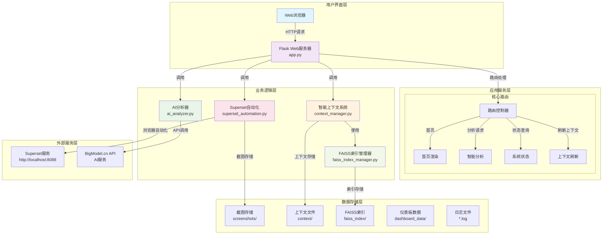

## 详细模块架构

### 1. 启动与部署模块

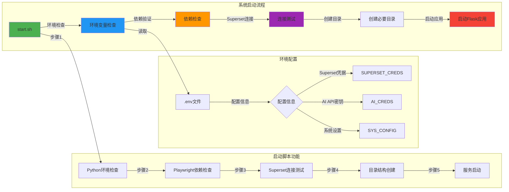

**启动脚本详细功能 (start.sh):**

1. **环境检查阶段**
   - Python环境检测 (支持 python3 和 python 命令)
   - 环境变量文件 (.env) 检查
   - 必要配置项验证 (Superset和API凭据)

2. **依赖验证阶段**
   - Playwright库安装检查
   - 自动安装缺失依赖
   - Chromium浏览器安装

3. **连接测试阶段**
   - 异步Superset连接测试
   - 登录功能验证
   - 仪表板列表获取测试
   - 连接失败时的降级处理

4. **环境准备阶段**
   - 创建screenshots目录 (截图存储)
   - 创建dashboard_data目录 (仪表板数据)
   - 权限和路径验证

5. **服务启动阶段**
   - Flask应用启动
   - 系统信息展示
   - 访问地址和健康检查端点显示

### 2. 数据采集层架构

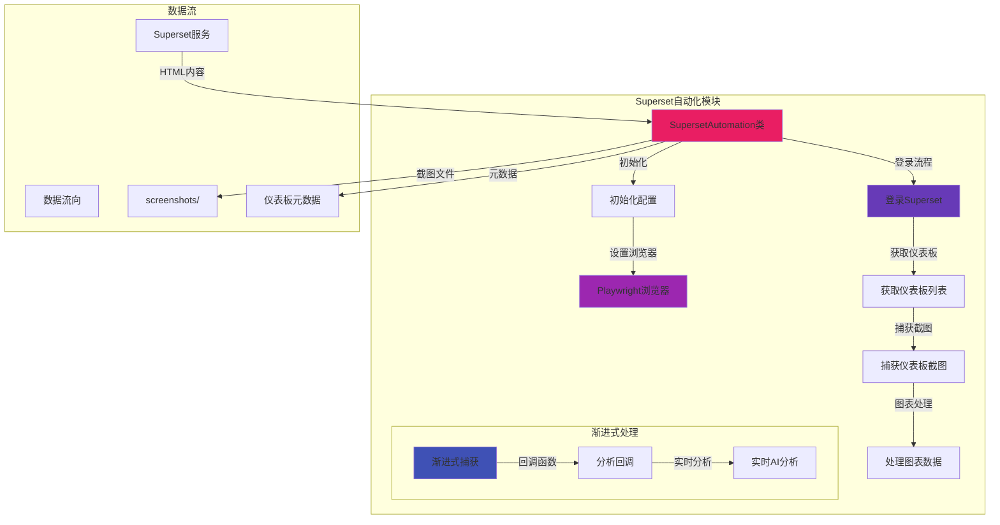

### 3. AI分析层架构

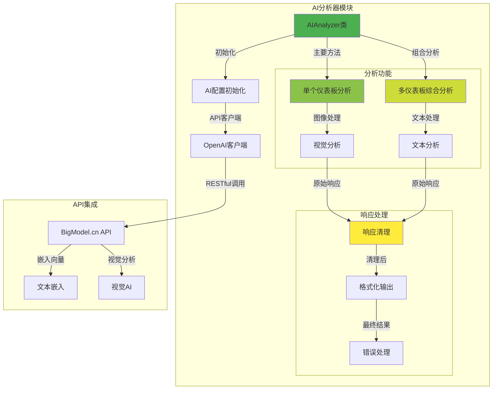

### 4. 上下文管理层架构

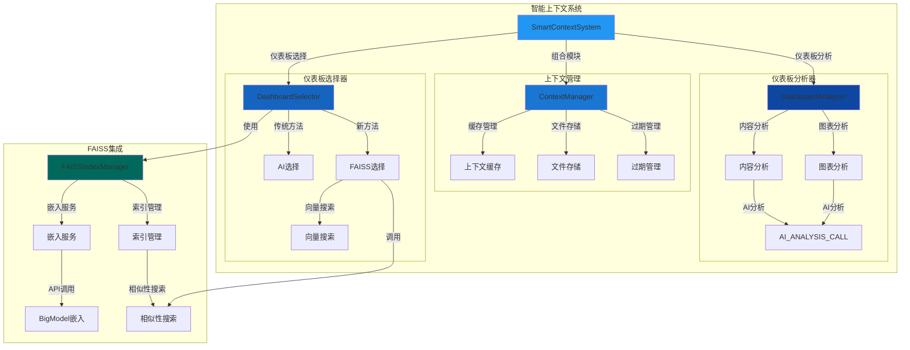

### 5. FAISS向量搜索架构

```mermaid
graph TB
    subgraph "FAISS嵌入服务"
        EMBEDDING_SVC[FAISSEmbeddingService]
        EMBEDDING_SVC -->|初始化| INIT_INDEX[创建索引]
        EMBEDDING_SVC -->|嵌入生成| GEN_EMBEDDING[生成嵌入]
        EMBEDDING_SVC -->|批量处理| BATCH_PROCESS[批量处理]
        EMBEDDING_SVC -->|搜索功能| SEARCH[相似性搜索]
        
        subgraph "索引类型"
            FLAT_INDEX[Flat索引]
            IVF_INDEX[IVF索引]
            HNSW_INDEX[HNSW索引]
        end
        
        INIT_INDEX -->|选择| FLAT_INDEX
        GEN_EMBEDDING -->|文本处理| TEXT_PROCESSING[文本处理]
        TEXT_PROCESSING -->|API调用| BIGMODEL_API
        BIGMODEL_API -->|嵌入向量| EMBEDDING_VECTOR[嵌入向量]
        EMBEDDING_VECTOR -->|添加到索引| ADD_TO_INDEX[添加到索引]
    end
    
    subgraph "索引管理器"
        INDEX_MGR[FAISSIndexManager]
        INDEX_MGR -->|上下文集成| CONTEXT_INTEGRATION[上下文集成]
        INDEX_MGR -->|自动更新| AUTO_UPDATE[自动更新]
        INDEX_MGR -->|状态监控| STATUS_MONITOR[状态监控]
        
        CONTEXT_INTEGRATION -->|构建索引| BUILD_INDEX[构建索引]
        BUILD_INDEX -->|从上下文| FROM_CONTEXTS[从上下文数据]
        FROM_CONTEXTS -->|批量嵌入| BATCH_EMBEDDINGS[批量嵌入]
    end
    
    subgraph "数据持久化"
        INDEX_FILE[FAISS索引文件]
        METADATA_FILE[元数据文件]
        CONTEXT_FILES[上下文文件]
        
        EMBEDDING_SVC -->|保存索引| INDEX_FILE
        EMBEDDING_SVC -->|保存元数据| METADATA_FILE
        INDEX_MGR -->|读取上下文| CONTEXT_FILES
    end
    
    style EMBEDDING_SVC fill:#009688
    style INDEX_MGR fill:#004d40
    style BIGMODEL_API fill:#795548
```

### 6. Web界面层架构

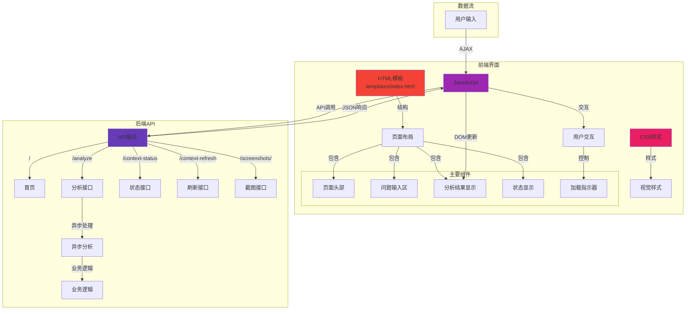

## 用户旅程图

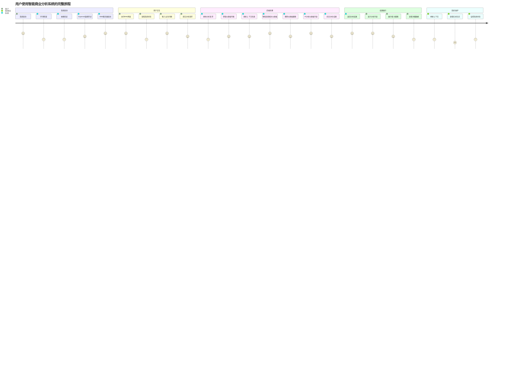

## 数据流图

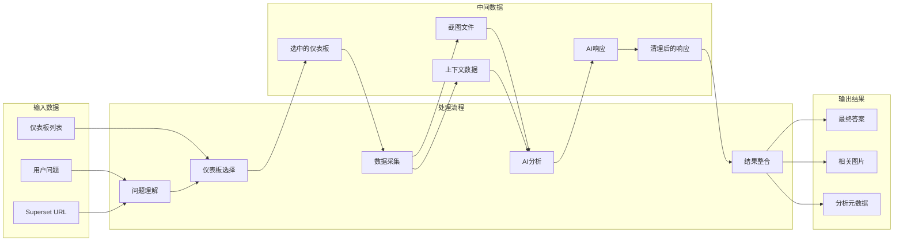

## 技术栈详情

### 后端技术栈
- **Python 3.x** - 主要编程语言
- **Flask 2.3.3** - Web框架
- **Playwright** - 浏览器自动化
- **OpenAI** - AI客户端
- **FAISS** - 向量搜索库
- **NumPy** - 数值计算
- **Requests** - HTTP客户端
- **python-dotenv** - 环境变量管理

### 前端技术栈
- **HTML5** - 页面结构
- **CSS3** - 样式设计
- **JavaScript** - 交互逻辑
- **响应式设计** - 移动端适配

### 外部服务
- **Superset** - 数据可视化平台
- **BigModel.cn** - AI服务提供商

### 数据存储
- **文件系统** - 截图和上下文存储
- **FAISS索引** - 向量搜索索引
- **Markdown文件** - 上下文数据

## 部署架构

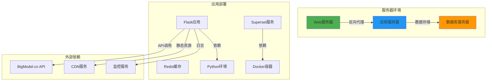

## 系统监控与日志

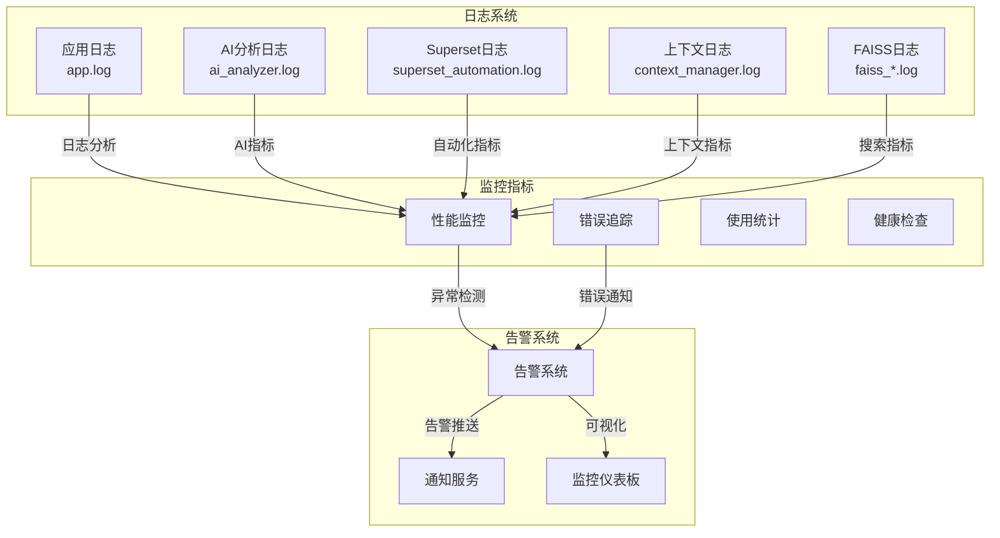

## 安全考虑

### 数据安全
- 环境变量存储敏感信息
- API密钥加密存储
- 文件访问权限控制
- 请求频率限制

### 系统安全
- 输入验证和清理
- SQL注入防护
- XSS攻击防护
- CSRF保护

### 网络安全
- HTTPS加密传输
- API访问认证
- 防火墙配置
- 安全头部设置

## 性能优化

### 缓存策略
- 上下文数据缓存
- FAISS索引缓存
- 静态资源缓存
- AI响应缓存

### 异步处理
- 异步任务队列
- 非阻塞I/O操作
- 并发处理优化
- 资源池管理

### 数据库优化
- 索引优化
- 查询优化
- 连接池管理
- 读写分离

## 扩展性设计

### 水平扩展
- 微服务架构
- 负载均衡
- 容器化部署
- 自动扩缩容

### 功能扩展
- 插件系统
- API扩展
- 多语言支持
- 第三方集成

## 总结

这个智能商业分析系统采用现代化的架构设计，集成了多种先进技术：

1. **模块化设计** - 各个功能模块独立，便于维护和扩展
2. **异步处理** - 支持长时间运行的分析任务
3. **智能化** - 结合AI和向量搜索提供智能分析
4. **可扩展性** - 支持多种部署方式和扩展需求
5. **用户友好** - 现代化的Web界面和良好的用户体验

系统通过FAISS向量搜索解决了传统AI选择中的token限制问题，提供了更加高效和可扩展的解决方案。